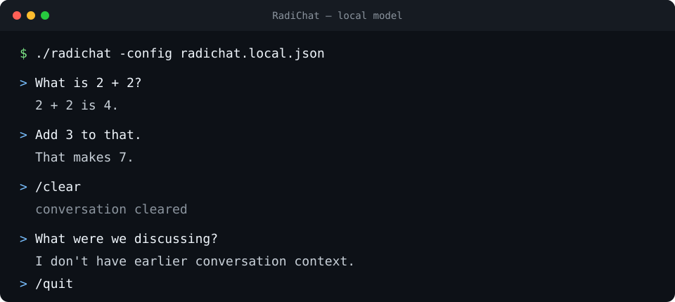
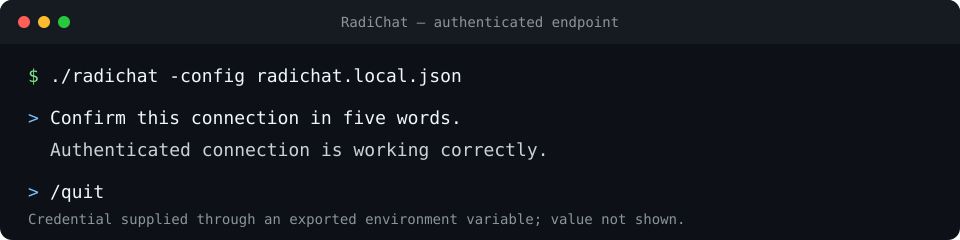

# RadiChat

**A small Linux terminal client for local and remote OpenAI-compatible chat endpoints.**

RadiChat is for people who want streamed, multi-turn chat without an agent framework, database, browser UI, or background service. It is designed around local models and small context windows, while retaining an optional bearer-authenticated path for compatible remote endpoints.

The project exists to keep the client side boring: one Go binary, one JSON file, one in-memory conversation, and clear failures instead of discovery or fallback magic.



## Features

- Streamed OpenAI-compatible Chat Completions in a line-oriented terminal UI.
- Local unauthenticated endpoints work without credentials or environment setup.
- Optional bearer authentication through an environment variable named by the config file.
- Multi-turn context held only in process memory.
- Deterministic context-budget trimming for small model windows.
- `/clear` to reset conversation history and `/quit` to exit.
- Strict HTTPS verification, redirect refusal, no retries, and no proxy discovery.
- One Linux executable built with the Go standard library only.

## Who it is for

RadiChat fits developers and model users who already have an OpenAI-compatible endpoint and want a transparent terminal client. It works especially well for local inference servers, constrained models, shell workflows, and environments where storing chat history or credentials is undesirable.

It is intentionally not an agent runtime, automation harness, model server, or full-screen TUI.

## Install from source

RadiChat currently ships from source. You need Linux and Go 1.22 or newer.

```bash
git clone https://github.com/radilabs/radichat.git
cd radichat
go build -o radichat .
```

The build produces one executable in the repository root. The accepted checkpoint is tested on Linux/amd64 with Go 1.27.1 and has no third-party module dependencies.

Run the project checks with:

```bash
go test ./...
go vet ./...
go test -race ./...
```

## Local-model quick start

Start an OpenAI-compatible server, then copy the safe loopback example:

```bash
cp radichat.example.json radichat.local.json
```

Edit `radichat.local.json` so `endpoint` is the server's complete Chat Completions URL and `model` is a model it serves. The default example uses:

```json
{
  "endpoint": "http://127.0.0.1:8080/v1/chat/completions",
  "model": "local-model",
  "context_budget": 8192,
  "generation_reserve": 1024,
  "system_prompt": "You are a concise assistant."
}
```

Run RadiChat:

```bash
./radichat -config radichat.local.json
```

No token is needed. `radichat.local.json` and the default `radichat.json` are ignored by Git.

## Authenticated endpoint

The tracked [`radichat.remote.example.json`](radichat.remote.example.json) contains placeholders only:

```json
{
  "endpoint": "https://api.example.invalid/v1/chat/completions",
  "model": "remote-model",
  "context_budget": 8192,
  "generation_reserve": 1024,
  "system_prompt": "You are a concise assistant.",
  "bearer_token_env": "RADICHAT_BEARER_TOKEN"
}
```

Copy it to an ignored local file, replace the endpoint and model, and export the named variable in the same shell:

```bash
cp radichat.remote.example.json radichat.local.json
export RADICHAT_BEARER_TOKEN='<your-token>'
./radichat -config radichat.local.json
```

The JSON stores the environment-variable name, never the credential. If the variable is unset, empty, or unsuitable for an HTTP header, RadiChat exits before contacting the network. Avoid putting credentials directly in config files, command arguments, or shell history.



The capture uses a loopback mock endpoint and a dummy credential; no credential, private endpoint, hostname, model, username, or local path is shown.

## Configuration

RadiChat reads one strict JSON object. Unknown or duplicate fields fail at startup.

| Field | Required | Meaning |
| --- | --- | --- |
| `endpoint` | yes | Complete `http://` or `https://` Chat Completions URL. |
| `model` | yes | Model name sent unchanged to the endpoint. |
| `context_budget` | yes | Positive application working-budget units for request context. |
| `generation_reserve` | yes | Positive completion reserve and `max_tokens`; must be smaller than the context budget. |
| `system_prompt` | no | Fixed leading system message. |
| `bearer_token_env` | no | Name of the environment variable containing the bearer token. |

See [Configuration](docs/configuration.md) for validation rules and [Context accounting](docs/context-accounting.md) for the deterministic byte-based budget policy.

## Terminal commands

| Command | Effect |
| --- | --- |
| `/clear` | Clear in-memory user/assistant history while retaining the configured system prompt. |
| `/quit` | Exit successfully. |
| Ctrl-C | Cancel and discard an in-flight turn, then exit. |
| EOF | Exit after processing any final input line. |

Blank lines are ignored. Unknown slash commands are rejected locally and are not sent to the model. See [CLI behavior](docs/cli.md) for streams, errors, and exit codes.

## Supported protocol subset

RadiChat sends one `POST` to the configured URL with:

- `Content-Type: application/json` and `Accept: text/event-stream`;
- `model`, `messages`, `stream: true`, and `max_tokens` in the JSON body;
- `system`, `user`, and `assistant` text messages only;
- an optional `Authorization: Bearer …` header when configured.

It expects Server-Sent Events containing OpenAI-compatible `choices[].delta.content` strings followed by `data: [DONE]`. It supports normal text streaming, role-only chunks, UTF-8 text, CRLF or LF framing, and `stop` or `length` completion reasons.

RadiChat deliberately rejects redirects, non-streaming responses, malformed or unfinished streams, multiple choices, tool/function calls, and unsupported finish reasons. Requests are not retried. HTTPS uses system roots with TLS 1.2 or newer; there is no insecure mode or custom-CA option.

The exact behavior and limits are documented in [Protocol subset](docs/protocol.md).

## Context and privacy model

Conversation history lives only in memory and disappears when the process exits. RadiChat writes no transcript, session database, credential file, or log. When a request would exceed `context_budget`, it drops the oldest complete user/assistant pairs while retaining the system prompt and current user message.

Bearer tokens live in process memory after startup. The authenticated path omits untrusted response bodies, redirect destinations, and underlying transport text from diagnostics, and filters exact credential echoes from streamed output. Process environments are not encrypted and may still be visible to the same user or system administrator.

## Limitations and non-goals

- Linux is the only release target currently verified.
- The client supports a narrow streaming Chat Completions subset, not every provider extension.
- Context accounting uses deterministic UTF-8 byte-based units, not a model tokenizer.
- There is no endpoint discovery, hidden fallback, automatic retry, or non-streaming fallback.
- There is no session persistence, database, compaction, or summarization.
- There are no tools, function execution, agents, RAG, embeddings, MCP, browser control, or shell execution.
- There is no OAuth flow, credential store, provider-specific login, TLS bypass, or custom CA handling.
- There is no GUI or full-screen TUI.

These boundaries are product choices for the current release state, not missing setup steps.

## Project status and release information

Stage 1 is accepted: local chat and optional endpoint authentication are complete and independently verified. `main` is the current public-ready checkpoint.

There are **no tagged versions or packaged GitHub releases yet**, and the repository does not currently define a versioning policy. `v0.1.0` is the natural initial-release proposal for this accepted feature set, but no tag or release has been created.

High-level roadmap:

- Phase 0 — repository and product contracts: accepted.
- Phase 1 — unauthenticated local chat core: accepted.
- Phase 2 — optional bearer authentication: accepted.
- Later capabilities require an explicit new phase; none is currently authorized.

## Documentation

- [Configuration](docs/configuration.md)
- [Protocol subset](docs/protocol.md)
- [Context accounting](docs/context-accounting.md)
- [CLI behavior](docs/cli.md)
- [Accepted Phase 2 handoff](docs/handoffs/phase-2.md)
- [Product direction](PROJECT.md)

## License

RadiChat is available under the [MIT License](LICENSE). Copyright © 2026 Radilabs by Forthscale.
